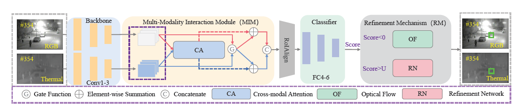
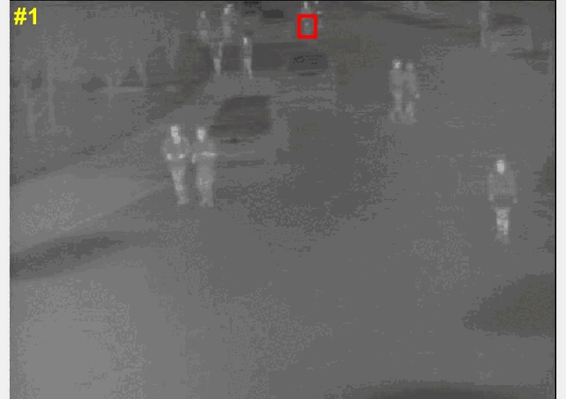
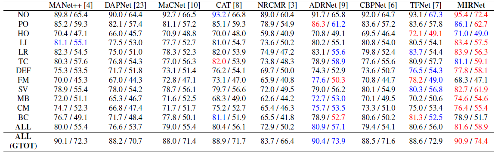

# ICME22-MIRNet
This is the results of the ICME2022 paper "MIRNet: A Robust RGBT Tracking Jointly with Multi-Modal Interaction and Refinement".


RGBT tracking attempts to design a robust all-weather tracker by integrating the complementary features of visible and thermal spectrums. To explore the latent interdependencies across modalities, we propose a novel real-time tracker named MIRNet, which contains a multi-modal interaction module (MIM) and a refinement mechanism (RM), thereby adaptively merging multi-modal features and achieving precise scale estimation. Specifically, to enhance instance representation in lowquality modality, the MIM reinforces discriminative features from one modality to another in a bidirectional way. Considering the negative effects of unreliable modality, we further introduce a gate function in MIM to filter redundancy. To address the problem of random drifting and estimate the precise scale in the online tracking, we present a well-designed RM that combines optical flow and refinement network. Comprehensive experiments on two public RGBT benchmarks validate that our tracker outperforms the state-of-the-art methods.
<div align="center">
   
</div>

## 🌟GTOT and RGBT234 results
You can download the raw result MIR-rgbt234.zip and MIR-gtot.zip

**GTOT PR:0.909 SR:0.744**
**RGBT234 PR:0.816 SR:0.589**
 

## Citation
Please cite this paper in your publications if it helps your research:

```
[1] Ruichao Hou, Boyue Xu, Tongwei Ren, Gangshan Wu. Proceedings of IEEE International Conference on Multimedia and Expo (ICME'23), Brisbane, Australia, 2023.

[2] Hou, Ruichao, Tongwei Ren, and Gangshan Wu. "MIRNet: A Robust RGBT Tracking Jointly with Multi-Modal Interaction and Refinement." 2022 IEEE International Conference on Multimedia and Expo (ICME). IEEE, 2022.
```

